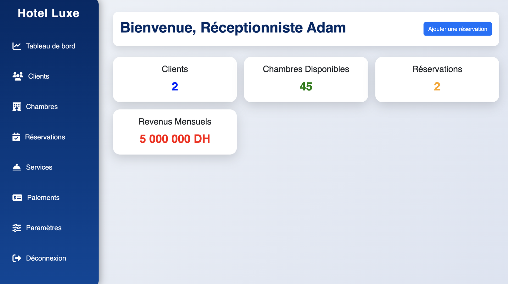
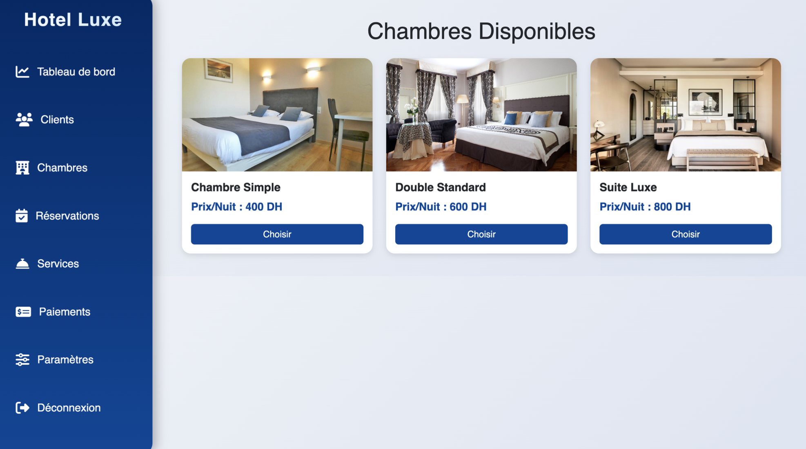
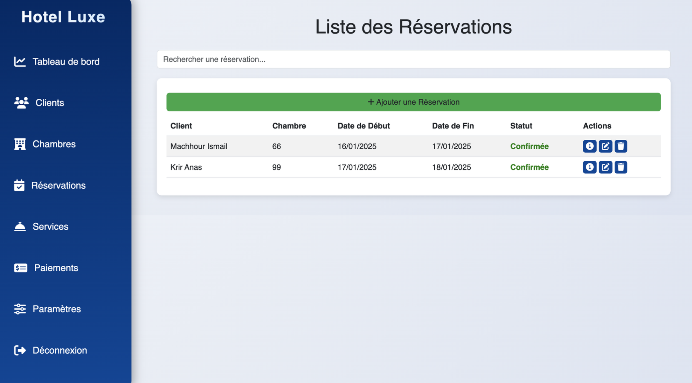

# 🏨 HotelManagement — Application web de gestion hôtelière (.NET MVC)


Application web développée en **.NET Core MVC (C#)** permettant la gestion complète d’un **hôtel** : chambres, réservations, services, clients, paiements…

L’interface est basée sur **Razor Pages + Bootstrap 5**, et la base de données est gérée via **SQL Server** (Azure Data Studio / Docker).

---

## 📌 Sommaire

1. [Fonctionnalités](#-fonctionnalités)
2. [Stack technique](#-stack-technique)
3. [Architecture du projet](#-architecture-du-projet)
4. [Démarrage rapide](#-démarrage-rapide)
    - [Prérequis](#-prérequis)
    - [Installation & Configuration](#2-installation--configuration)
    - [Lancement de l’application](#3-lancement-de-lapplication)
5. [Aperçu (UI Screenshots)](#-aperçu-ui-screenshots)
6. [Auteurs](#-auteurs)
7. [Licence](#-licence)

---

## ✅ Fonctionnalités

🛎️ Gestion des **réservations** (création, modification, annulation)  
🛏️ Gestion des **chambres** (type, prix, disponibilité, état)  
👤 Gestion des **clients**  
🛠️ Gestion des **services de l’hôtel** (spa, restaurant, etc.)  
💳 Gestion des **paiements**  
📊 Tableau de bord **réceptionniste**  
🔐 Authentification & rôles (en cours)  
🐳 Support **Docker + SQL Server container**  

---

## 🛠️ Stack technique

| Technologie | Version |
|-------------|---------|
| .NET | 8 (Core MVC) |
| Langage | C# |
| Frontend | Razor Pages + Bootstrap 5 |
| Base de données | SQL Server |
| ORM | Entity Framework Core |
| Container | Docker + mssql/server |
| IDE conseillé | VS Code / Visual Studio / Rider |
| Modélisation | StarUML |
| Outil DB | Azure Data Studio |

---

## 🏗️ Architecture du projet

```
HotelManagement
├─ Controllers/ → Logique de contrôle (MVC)
├─ Models/ → Entités + Classes métier
├─ Views/ → Pages Razor (.cshtml)
├─ Data/ → DbContext + Migrations
├─ wwwroot/ → CSS / JS / Assets
├─ appsettings.json → Configuration SQL Server
└─ Program.cs → Point d’entrée
```


---

## 🚀 Démarrage rapide

### 1️⃣ Prérequis

✅ .NET SDK 8+  
✅ SQL Server (local ou Docker)  
✅ Azure Data Studio (ou SSMS)  
✅ VS Code ou Visual Studio  
✅ Git installé


### 2️⃣ Installation & Configuration

```
# Cloner le projet

git clone https://github.com/AnasKrir/H-telLuxe.git
cd HotelManagement

# Restaurer les packages

dotnet restore
```

#### ➡️ Configurer la base de données dans `appsettings.json` :
```
"ConnectionStrings": {
  "DefaultConnection": "Server=localhost,1433;Database=HotelDB;User Id=sa;Password=Password;"
}
```

###  3️⃣ Lancement de l’application 

#### Lancer les migrations EF Core
```
dotnet ef database update
```
#### Démarrer l'application

```
dotnet run
```

Ou via VS Code

➡️ Run > Start Debugging

---

## 🎨 Aperçu (UI Screenshots)

| Login               | Dashboard               | Chambres            | Réservations              | Services               |
| ------------------- | ----------------------- | ------------------- | ------------------------- | ---------------------- |
|  |  |  |  |  |

---

## 👥 Auteurs


| Nom                 | Rôle                                |
| ------------------- | ----------------------------------- |
| **KRIR Anas**       | Développeur Back-End / Architecture |
| **EL YOURI Adam**   | UI/Frontend & Intégration           |
| **MACHHOUR Ismail** | Base de données & Services          |

---

## 📄 Licence

Projet sous licence MIT.<br/>
✅ Libre d’utiliser, modifier et distribuer.

---

© 2024 — KRIR Anas & EL YOURI Adam & MACHHOUR Ismail

---
